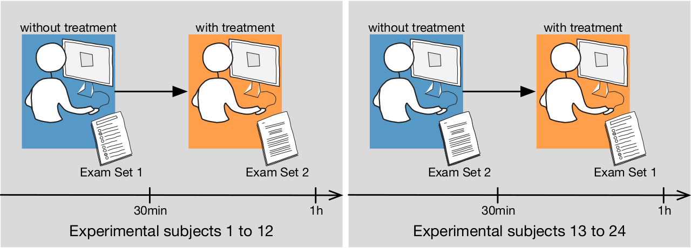
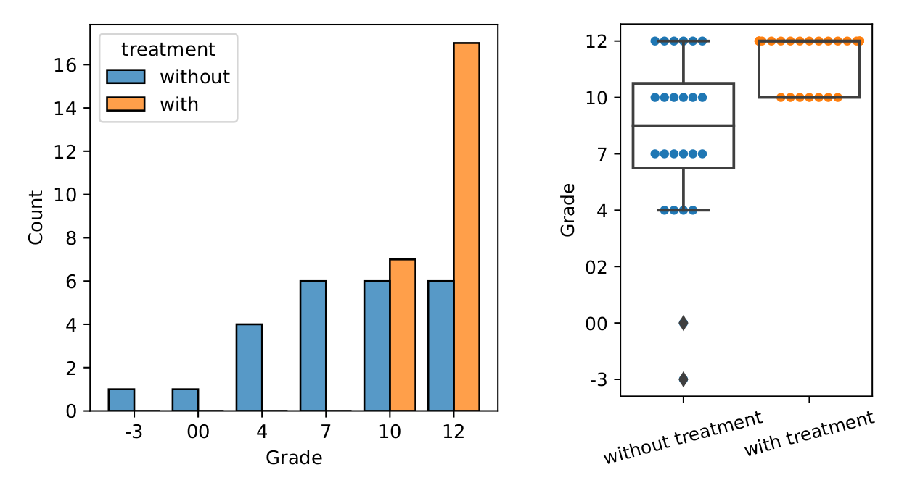
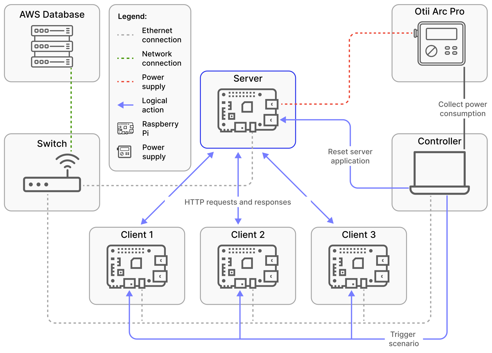
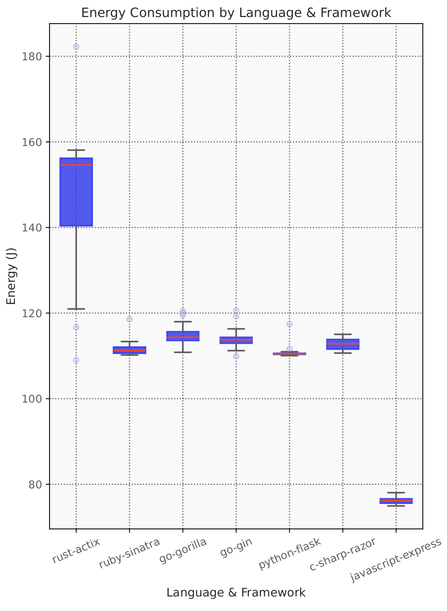
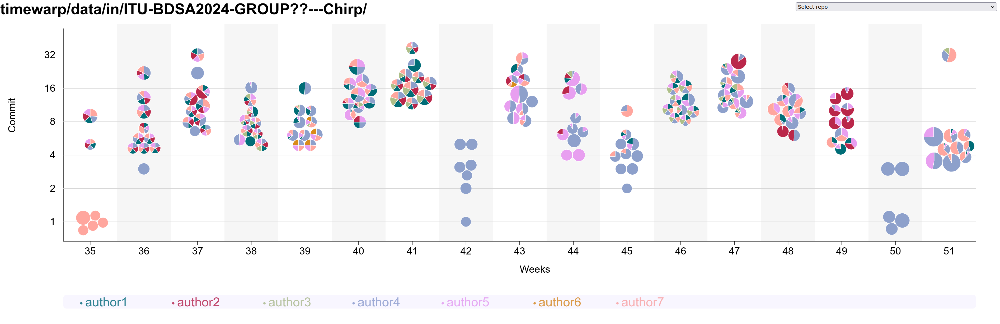
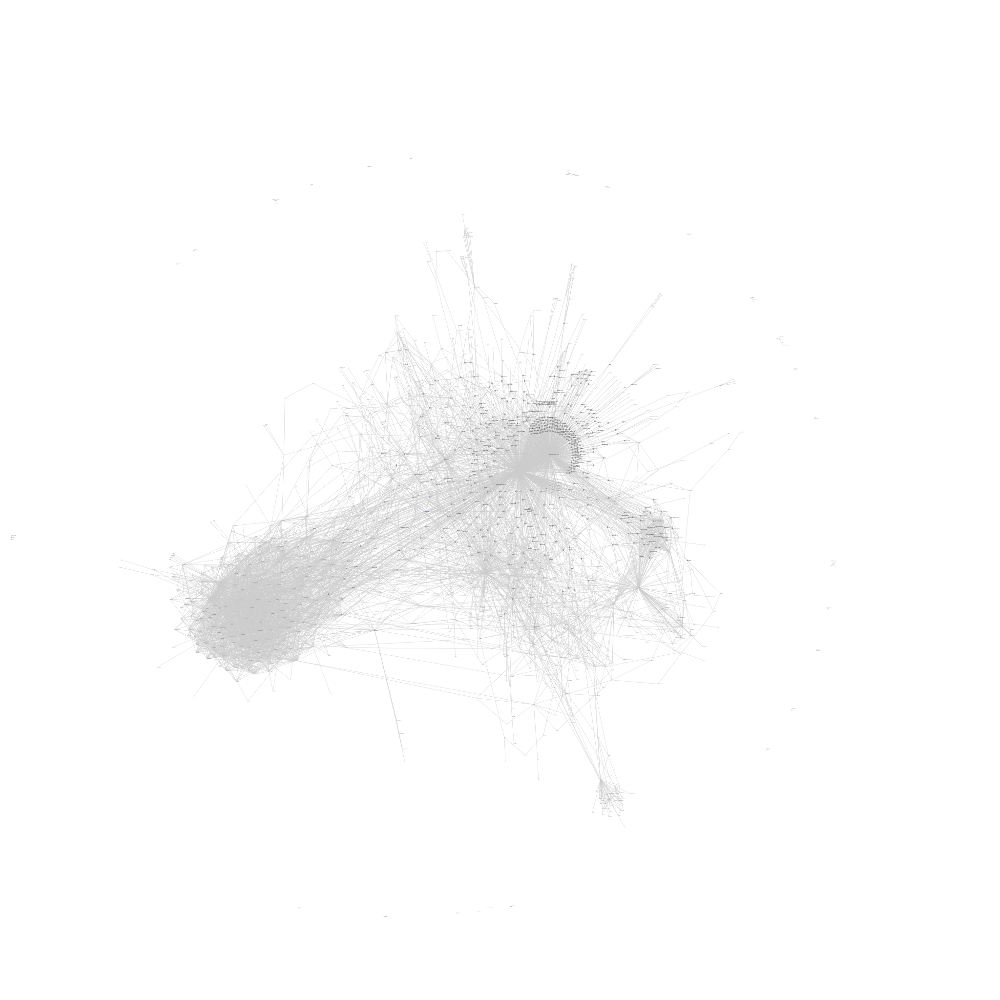

class: center, middle


# DevOps, Software Evolution and Software Maintenance

Helge Pfeiffer, Associate Professor,<br>
[Research Center for Government IT](https://www.itu.dk/forskning/institutter/institut-for-datalogi/forskningscenter-for-offentlig-it),<br>
[IT University of Copenhagen, Denmark](https://www.itu.dk)<br>
`ropf@itu.dk`


---

class: center, middle

# Feedback: The state of your projects?

---

### Release Activity

<object width="100%" data="http://134.209.249.148/release_activity_weekly.svg"></object>

---

### Weekly Commit Activity

<object width="100%" data="http://134.209.249.148/commit_activity_weekly.svg"></object>

---

### Latest processed events?

<object width="100%" data="http://138.68.85.121/chart.svg"></object>

---

### Error plot

<object width="100%" data="http://138.68.85.121/error_chart.svg"></object>

---

## How do you feel it is going with your projects?

---

class: center, middle

# Exam Preparation

---

## What to do now?

  * Start writing your [report](../../REPORT.md)

---

### Report

Last time, I presented the requirements for the [report](../../REPORT.md).

Are there any questions, or do you know what to do?


---

### Exam Preparation

  * You can find a deeper description of the exam and how it is conducted [here](../../exam_details.md).
  * See exam description on [LearnIT](https://learnit.itu.dk/local/coursebase/view.php?ciid=1896) under section _Ordinary exam_
  * The course and exam are based on your project. However, the entire curriculum is relevant for the exam.


--

  * Please let us know in good time before the exam if you have any special conditions that lead to that you have longer exam times so that we can schedule accordingly.

---

#### "I want to have the exam on day ..."

  * We cannot promise that the exams can be scheduled so that everybody is 100% happy with its placement.
  * But you can help us scheduling by indicating your preferred days and days you would like to avoid in the [shared spreadsheet](https://ituniversity.sharepoint.com/:x:/r/sites/2026MScDevOpsSoftwareEvolutionandSoftwareMaintenance/Shared%20Documents/General/Groups.xlsx?d=w75f28a88ccae434ba16465ed310e9192&csf=1&web=1&e=yg4VXB).

Important, when editing the spreadsheet, please make sure that the number of group members is still correct. If not please update it and inform us about it (by sending a message in the Teams channel to us).

---

class: center, middle

# Evaluation

---

### Evaluation

Dear all (2026 MSc DevOps, Software Evolution and Software Maintenance),

As mentioned in class, the course is almost over, so it is time for evaluating it.

We run an evaluation that should be really easy and should consume only a few minutes of your time.
The purpose of the evaluation is to provide feedback so that Mircea and I can improve the course next year.

I would like to ask you to provide up to three negative and up to three positive comments about the course. You can do that here: http://134.209.249.148:8888/
Please note, the kind of evaluation mimics a public paper-based process.
That is, all information that you enter as feedback will be read by your peers, Helge, Mircea, and the TAs, i.e., it is public information.
Please provide your feedback latest by Thursday (May 7th) 12:00.

Thank you in advance.

---

### ITU-wide Evaluation

Please participate in the ITU-wide evaluation on LearnIT.
Four years ago, the response rate for this course on LearnIT was 0%, which is unpractical since ITUs management mainly looks at these evaluation results:

  * https://learnit.itu.dk/mod/questionnaire/view.php?id=246540

---

class: center, middle

# [Why do all good things come to an end?](https://youtu.be/4pBo-GL9SRg?t=41)

---

### The Simulator stops now!

```bash
pkill -f minitwit_simulator
```

---

### Lean back, relax a bit, and be proud of yourselves


---

### Release Activity

<object width="100%" data="http://134.209.249.148/release_activity_weekly.svg"></object>

---

### Weekly Commit Activity

<object width="100%" data="http://134.209.249.148/commit_activity_weekly.svg"></object>

---

### Latest processed events?

<object width="100%" data="http://138.68.85.121/chart.svg"></object>

---

### Error plot

<object width="100%" data="http://138.68.85.121/error_chart.svg"></object>


---

### How Does the Simulator Work?

@Helge: demonstrate on server

--

What did we actually do with the simulator?

---

### Load Testing

https://github.com/itu-devops/BSc_lecture_notes/blob/master/sessions/session_10/Slides.md#load-testing

---

class: center, middle

# Work with us?!


---

### Teaching Assistants for this course in 2027

From earlier evaluations:

  > * Great TA's! They were helpful many times for answering questions.
  > * [...] TAs are really good at presenting relevant stuff [...]!

---

### Teaching Assistants for this course (BSc) in 2027

Typical tasks:

  * Operate the simulator
  * Talk to and help student groups
  * Implement improvements in the teaching material and/or the course's technical infrastructure
  * Interact with teachers to point out recurring issues and problems from student groups

---

### Teaching Assistants for DevOps and Experimentation in Software Engineering (MSc) in 2027

Likely tasks:

  * Operate a simulator?
  * Talk to and help student groups
  * Implement improvements in the teaching material and/or the course's technical infrastructure
  * Interact with teachers to point out recurring issues and problems from student groups

---

#### Teaching Assistant for BDSA Fall 2027

Is a course with focus on a project, a Twitter-clone in C#/.Net called Chirp.

Contact: [Eduard Kamburjan](edka@itu.dk) about it.

Tasks:

  * Help prepare lecture and preparation material
  * Providing feedback and guidance to student groups
  * 15ECTS course, i.e., many paid hours of work 😀

---

class: center, middle

# Thesis/Project Topics

---

### What I do not want to supervise as projects next year

  * _"We want to do something with Kubernetes"_
  * _"We want to implement a certain DevOps CI pipeline"_
  * In essence, theses that are directly related to the topics of this course 😀
    - Only exception: work on mining package managers or experimenting with [reproducible builds](https://reproducible-builds.org/), e.g., for [`pkgsrc`](https://pkgsrc.org/)

<!--
    - Only exception: you are working with a company and you plan to evaluate and measure quality in-/decrease by working in a certain way.
 -->


--

### What I would like to supervise

  * Mining (VCS, issue trackers, etc.) studies
  * Projects on software quality, software quality assessments
  * Tools implementing software quality metrics
  * Projects on the following examples


  * Group projects (3 to 4 students)
  * Importantly, you are **motivated**
  * Please contact me **in person** in case you are interested.

---

### Example: Bootstrappable Builds

In this lecture, we talked about supply chain attacks, see [security lecture](../session_09/Slides.html).

Ken Thompsen explained a specific supply chain attacks in his Turing Lecture [_"Reflections on Trusting Trust"_](https://users.ece.cmu.edu/~ganger/712.fall02/papers/p761-thompson.pdf).
Read Russ Cox' [article](https://research.swtch.com/nih), which contains the complete example from the Turing Lecture.


<!--

More resources on the topic:

- https://bootstrappable.org/
- https://lwn.net/Articles/841797/
- https://dwheeler.com/trusting-trust/
- [David A. Wheeler _"Countering Trusting Trust through Diverse Double-Compiling"_](https://web.archive.org/web/20051221041751/http://www.acsa-admin.org/2005/papers/47.pdf)

- https://stagex.tools/support/
- https://github.com/fosslinux/live-bootstrap
 -->

Research Questions:

- How to modify `pkgsrc` so that the existing [`bootstrap` script](https://github.com/NetBSD/pkgsrc/blob/trunk/bootstrap/bootstrap) bootstraps the compilers too?
- How can that be done for other compilers that are distributed as `pkgsrc` packages, e.g., Go, Java?

<tiny>Image source: <a href="https://research.swtch.com/nih">https://research.swtch.com/nih</a></tiny>

---

### Example: From Version Control System (VCS) to Binary

The cross-platform package manager [`pkgsrc`](https://pkgsrc.org/), defines packages via `Makefiles`.

```Makefile
DISTNAME= nano-8.7
CATEGORIES= editors
MASTER_SITES= https://www.nano-editor.org/dist/v${PKGVERSION_NOREV:C/\..*$//}/
EXTRACT_SUFX= .tar.xz

MAINTAINER= wiedi@frubar.net
HOMEPAGE= https://www.nano-editor.org/
COMMENT=  Small and friendly text editor (a free replacement for Pico)
LICENSE=  gnu-gpl-v3

---snip---
```

On build, sources are _fetched_ from releases (`MASTER_SITES`).


<!--

```bash
$ ~/pkg/bin/bmake -vMASTER_SITES
https://www.nano-editor.org/dist/v8/
```

-->

--

Research Questions:

- How to modify `pkgsrc` so that sources are received directly from version control system (VCS) instead of release?
- How to automatically identify VCS repositories for `pkgsrc` packages?

<tiny>Source: <a href="https://github.com/NetBSD/pkgsrc/blob/0efa608749819021a349e06d80a56924ba0c76a4/editors/nano/Makefile">https://github.com/NetBSD/pkgsrc/blob/0efa608749819021a349e06d80a56924ba0c76a4/editors/nano/Makefile</a></tiny>

---

### Example: Effects of a Local LLM in an Introductory Programming Exam

<table>
  <tr>
    <td>
      
    </td>
    <td>
      
    </td>
  </tr>
</table>


Project:
  - Improve experiment design
  - Finalize experiment tooling
  - Recruit experiment subjects
  - Conduct a controlled experiment
  - Analyze and present results

---

### Example: Energy Consumption of Software 2024 (BSc/MSc)

E.S. Trindade, G. Meding, S. Harwick _"Energy Consumption in Web Applications: A Comparative Analysis of Languages, Frameworks, and Related Technologies"_

 

Possible projects:

  - Energy consumption of database
  - Energy consumption of network calls

---

### Example: RepoPie – Visualization of VCS (BSc/MSc)

A. Bagge-Kjær, C. Sønderborg, J. Klompmaker, S. Schalls _"Visualization of VCS histories over time"_



Possible projects:

  - Further development of tool and visualization
  - Scientific evaluation of usefulness of visualization

---

### Example: [DaSEA](https://github.com/DaSEA-project/DASEA) – A Dataset for Software Ecosystem Analysis (BSc/MSc)

P. Buchkova, J.H. Hinnerskov, K. Olsen, H. Pfeiffer [_"DaSEA – A Dataset for Software Ecosystem Analysis"_](https://itu.dk/~ropf/blog/assets/msr2022.pdf)



Possible projects:

  - Add more miners, especially for other operating systems (APT, Arch, ...)
  - Improve long-running miners of large ecosystems like Maven (Maven Central), .Net (NuGet), etc.
  - Update and operationalize mining
  - Execute studies with the dataset

---

### Mircea

Project ideas: go to [mircealungu.com](https://mircealungu.com/) and scroll to the *Student Projects* section. Follow the link for [*student projects on GitHub*](https://github.com/mircealungu/student-projects/).


---


